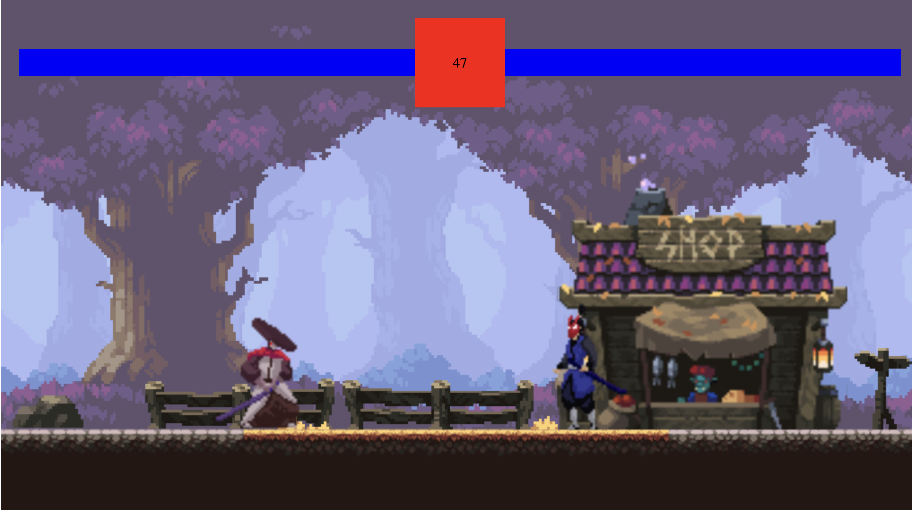

# 2D 2-Player Fighting Game

---

## Demo & Snippets

---

## Requirements / Purpose

### MVP

Create the following for a 2D 2 plater fighting game with Javascript and HTML:

1. Two player characters with basic movement and attacking abilities.
2. A simple game environment, such as a flat platform with basic background graphics.
3. Health bars for each player, displaying their current health points and decreasing as they take damage.
4. A way for players to win the game, such as reducing their opponent's health to zero or whoever has more health left over when the timer runs out.
5. Simple animations for actions such as attacking and moving.
6. A way to control the game, such as keyboard inputs or on-screen buttons.
7. Basic collision detection and physics, such as reacting to being hit with an attack.

### Purpose of Project

The purpose of this project was to learn the basics of game development as it provides an engagign and hands-on way for developers to improve skills in web development, game development, and programming in general.

It allowed me to improve programming skills through gaining understanding in programming concepts of data structures, algorithms, and control flows as well as learning how to create engaging game mechanics and systems.

### Tech stacks used:

Javascript and HTML are commonly used for game development due to the following:

1. Accessibility: JavaScript and HTML are accessible to many developers because they are both web technologies that can be run in a web browser.
2. Cross-platform compatibility: JavaScript and HTML games can be run on a variety of platforms and devices, including desktop computers, laptops, tablets, and smartphones.
3. Graphics and animation: HTML provides powerful graphics and animation capabilities through the use of the Canvas and SVG elements.
4. Interactivity: JavaScript provides interactivity by allowing developers to respond to user input and events in real-time.

---

## Build Steps

There are no installations or requirements to run the project. Simply clone the respository and open the 'index.html" file in any preferred web broswer to view.

---

## Design Goals / Approach

The design goal for this project was to create a simple yet gamelike fighting game web application that allows users to compete with one other player to win the fight by either decreasing their health to nil or having more health before the timer runs out.

The project was approached with a simplistic mindset where the priority was to ensure collision between the two players were correctly identified and the attack detection worked properly and was shown in the health bar.

---

## Features

- Health bars: Display health bars for each player, showing the amount of health remaining and any damage taken during the fight.
- Timer: Display a timer that will automatically detect winner based on health bar status.
- Features an animated background (smoke coming from house)
- Features animations for:
  - Left and right movement
  - Jumping
  - Attacking
  - Death

---

## Known issues

- One sprite (player) attacks faster than the other
- One sprite (player) collision is sometimes not read and thus health does not decrease.

---

## Future Goals

- Add sounds to basic actions such as jumping, attacking and winning.
- Add music in the background to amplify the user experience.
- Make the "winning player" component more visually appealing.
- Add some more styling for the timer and health bar for better user interface.
- Add instructions/tutorials and a way to restart the game.

---

## What did you struggle with?

- I struggled with understanding some of the concepts used in regards to create players as well as player movement.
- There were stuggles with understanding the collision methods and linking the collision to the health bar.

---

## Further details, related projects, reimplementations

---

## Contact

Feel free to reach out to me via ashleykouch99@gmail.com for any questions or collaboration opportunites.
